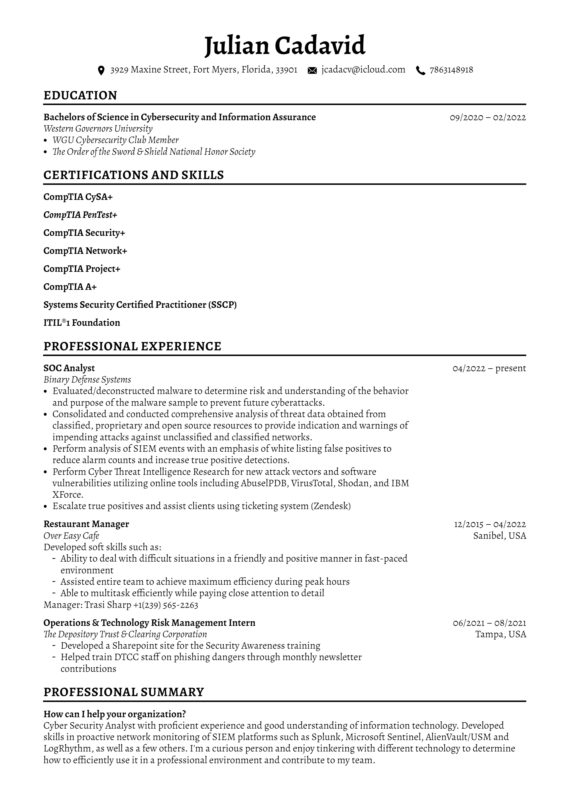

# Who is Space C4det

<figure><figcaption></figcaption></figure>

### **Hey there,**

I'm Julian, my buddies started calling me space cadet so I thought I'd assign myself the identity of Space C4det for my online presence. I've been into computers since ever since I got my hands on my first one, this was when I was 7 years old, my parents purchased an HP Desktop computer with an Intel Pentium processor if I'm remembering correctly. My siblings and I shared this computer between the four of us, it wasn't the greatest experience since we all had different interests and would annoy each other when we wanted some time on the internet. I remember playing games and loosing connection whenever the phone rang, this was because we had AOL Dial-Up. I still remember the day we moved to a different house and with a different house came a whole different Internet Provider and from there AOL Dial-Up was history!

I started my first security-related job in April of 2022 as a SOC Analyst. This was shortly after graduating from Western Governors University with my Bachelors of Science in Cybersecurity and Information Assurance!

<figure><figcaption></figcaption></figure>


