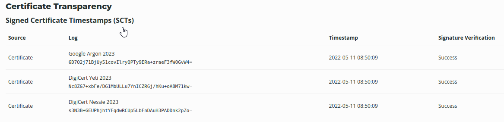

# Website Foot-printing With Netcraft

Netcraft can be used to enumerate information **passively** from a website.\
It also correlates information such as:

* WHOIS
* SSL or TLS certs
* Web Technologies being used
* Name servers

This saves you time from doing manual work, as Netcraft provides a lot of information that would otherwise take more time to gather if done manually.

Using results from our internet data mining, find out the technologies and infrastructure of any site.\
Explore hostnames visited by users of the Netcraft extensions. Search by domain or keyword.

**Important results given by Netcraft**\
Validity Period (Certificate)\
Certificate Issuer/Country\
Certificate Transparency\
Country: US\
Organizational unit: Not Present\
Subject Alternative Name: sni.cloudflaressl.com, hackersploit.org, \*.hackersploit.org\
Validity period: From May 11 2022 to May 10 2023 (11 months, 4 weeks, 2 days)\
SSLv3/POODLE or Heartbleed Vulnerable?\
No, not according to Netcraft

Web trackers\
This tells you what web analytics/trackers are enabled on the site

Site technologies Profiler

Issuing organization Cloudflare, Inc.\
Issuer common name Cloudflare Inc ECC CA-3

<figure><figcaption></figcaption></figure>

**Certificate Transparency**\

**Sender Policy Framework**\
A host's Sender Policy Framework (SPF) describes who can send mail on its behalf. This is done by publishing an SPF record containing a series of rules. Each rule consists of a qualifier followed by a specification of which domains to apply this qualifier to.
