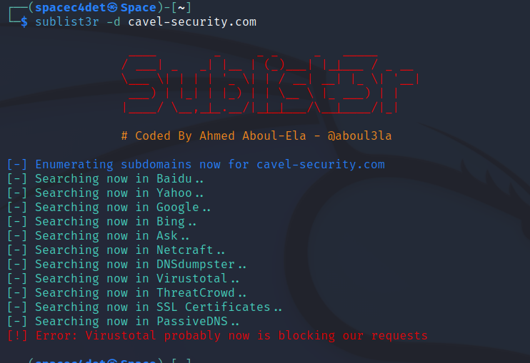

# Website Recon and Footprinting

## Footprinting

**Target: Hackersploit.org**

What we are looking for\
IP Addresses:\
IPv4: 172.67.202.99 and 104.21.44.180\
IPv6: 2606:4700:3036::ac43:ca63 and 2606:4700:3031::6815:2cb4\
Directories hidden from search engines: /wp-admin/, /wp-content/uploads/wpo-plugins-tables-list.json\
Names\
Email Addresses\
Phone Number\
Physical Addresses\
Web technologies being used: Use add-on "BuiltWith" to detect what technologies are being used.

Obtain IP Address by:\
use host command, use whatis host to learn more about this command

```
host hackersploit.org
```

```
┌──(kali㉿kali)-[~]
└─$ host hackersploit.org 
hackersploit.org has address 104.21.44.180
hackersploit.org has address 172.67.202.99
hackersploit.org has IPv6 address 2606:4700:3031::6815:2cb4
hackersploit.org has IPv6 address 2606:4700:3036::ac43:ca63
hackersploit.org mail is handled by 0 _dc-mx.2c2a3526b376.hackersploit.org.
```

Why does this website have two IPv4 Addresses?

* The website is behind CloudFlare, which is a Firewall/Proxy
  * If you ever come across a website using two IPv4 addresses
    * You're dealing with some sort of proxy

**Robots.txt**\
It essentially allows you to specify what folders or what files you don't want search engines to index

**sitemap.xml**\
A file that provides search engines an organized way of indexing a website.

```
XML Sitemap

Generated by Yoast SEO, this is an XML Sitemap, meant for consumption by search engines.
You can find more information about XML sitemaps on sitemaps.org.

This XML Sitemap Index file contains 4 sitemaps.
Sitemap	Last Modified
https://hackersploit.org/post-sitemap.xml	2022-12-28 12:26 +00:00
https://hackersploit.org/page-sitemap.xml	2023-02-09 09:12 +00:00
https://hackersploit.org/category-sitemap.xml	2022-12-28 12:26 +00:00
https://hackersploit.org/author-sitemap.xml	2021-01-27 19:55 +00:00
```

## **Helpful Addons**&#x20;

**Builtwith** - Web technology profiler tool that allows users to identify what technologies a website is using&#x20;

**Wappalyzer** - A web browser extension and open-source software that uncovers the technologies used on websites. It can detect content management systems, web frameworks, e-commerce platforms, JavaScript libraries, analytics tools, and many other technologies.&#x20;

**Whatweb** - A command-line tool used for website reconnaissance and information gathering. It can be used to detect what technologies a website is using, such as web servers, programming languages, and content management systems.&#x20;

**HTTRack**- This can be used to download a mirror of a website so you can analyze the source code to learn more about the site, ex: find vulnerabilities, get an understanding of the website structure etc

## Whois Enumeration

**whois** A query and response protocol that is widely used for querying databases that store the registered users or assignees of an internet resource, such as:

* Domain Name
* IP Address Block
* Autonomous System

```
┌──(kali㉿kali)-[~]
└─$ whois hackersploit.org
Domain Name: hackersploit.org
Registry Domain ID: 77f8fe62a425487cbefef4bf7e27d2ec-LROR
Registrar WHOIS Server: whois.namecheap.com
Registrar URL: http://www.namecheap.com
Updated Date: 2022-12-22T11:20:08Z
Creation Date: 2018-04-05T11:27:07Z
Registry Expiry Date: 2024-04-05T11:27:07Z
Registrar: NameCheap, Inc.
Registrar IANA ID: 1068
Registrar Abuse Contact Email: abuse@namecheap.com
Registrar Abuse Contact Phone: +1.6613102107
Domain Status: clientTransferProhibited https://icann.org/epp#clientTransferProhibited
Registry Registrant ID: REDACTED FOR PRIVACY
Registrant Name: REDACTED FOR PRIVACY
Registrant Organization: Privacy service provided by Withheld for Privacy ehf
Registrant Street: REDACTED FOR PRIVACY
Registrant City: REDACTED FOR PRIVACY
Registrant State/Province: Capital Region
Registrant Postal Code: REDACTED FOR PRIVACY
Registrant Country: IS
Registrant Phone: REDACTED FOR PRIVACY
Registrant Phone Ext: REDACTED FOR PRIVACY
Registrant Fax: REDACTED FOR PRIVACY
Registrant Fax Ext: REDACTED FOR PRIVACY
Registrant Email: Please query the RDDS service of the Registrar of Record identified in this output for information on how to contact the Registrant, Admin, or Tech contact of the queried domain name.
Registry Admin ID: REDACTED FOR PRIVACY
Admin Name: REDACTED FOR PRIVACY
Admin Organization: REDACTED FOR PRIVACY
Admin Street: REDACTED FOR PRIVACY
Admin City: REDACTED FOR PRIVACY
Admin State/Province: REDACTED FOR PRIVACY
Admin Postal Code: REDACTED FOR PRIVACY
Admin Country: REDACTED FOR PRIVACY
Admin Phone: REDACTED FOR PRIVACY
Admin Phone Ext: REDACTED FOR PRIVACY
Admin Fax: REDACTED FOR PRIVACY
Admin Fax Ext: REDACTED FOR PRIVACY
Admin Email: Please query the RDDS service of the Registrar of Record identified in this output for information on how to contact the Registrant, Admin, or Tech contact of the queried domain name.
Registry Tech ID: REDACTED FOR PRIVACY
Tech Name: REDACTED FOR PRIVACY
Tech Organization: REDACTED FOR PRIVACY
Tech Street: REDACTED FOR PRIVACY
Tech City: REDACTED FOR PRIVACY
Tech State/Province: REDACTED FOR PRIVACY
Tech Postal Code: REDACTED FOR PRIVACY
Tech Country: REDACTED FOR PRIVACY
Tech Phone: REDACTED FOR PRIVACY
Tech Phone Ext: REDACTED FOR PRIVACY
Tech Fax: REDACTED FOR PRIVACY
Tech Fax Ext: REDACTED FOR PRIVACY
Tech Email: Please query the RDDS service of the Registrar of Record identified in this output for information on how to contact the Registrant, Admin, or Tech contact of the queried domain name.
Name Server: dee.ns.cloudflare.com
Name Server: jim.ns.cloudflare.com
DNSSEC: unsigned
URL of the ICANN Whois Inaccuracy Complaint Form: https://www.icann.org/wicf/
>>> Last update of WHOIS database: 2023-02-14T01:42:33Z <<<
```

## Website Footprinting With Netcraft

Netcraft can be used to enumerate information **passively** from a website. Netcraft correlates information such as:

* WHOIS
* SSL or TLS certs
* Web Technologies being used
* Name servers

This saves you time from doing manual work, as Netcraft provides a lot of information that would otherwise take more time to gather if done manually.

Using results from our internet data mining, find out the technologies and infrastructure of any site. Explore hostnames visited by users of the Netcraft extensions. Search by domain or keyword.

**Important results given by Netcraft**&#x20;

Validity Period (Certificate)&#x20;

Certificate Issuer/Country&#x20;

Certificate Transparency&#x20;

Country: US&#x20;

Organizational unit: Not Present&#x20;

Subject Alternative Name: sni.cloudflaressl.com, hackersploit.org, \*.hackersploit.org&#x20;

Validity period: From May 11 2022 to May 10 2023 (11 months, 4 weeks, 2 days)&#x20;

SSLv3/POODLE or Heartbleed Vulnerable? No, not according to Netcraft

**Web trackers**&#x20;

This tells you what web analytics/trackers are enabled on the site

**Site technologies Profiler**

Issuing organisation Cloudflare, Inc.&#x20;

Issuer common name Cloudflare Inc ECC CA-3

**Certificate Transparency**&#x20;

<figure><figcaption></figcaption></figure>

**Sender Policy Framework** A host's Sender Policy Framework (SPF) describes who can send mail on its behalf. This is done by publishing an SPF record containing a series of rules. Each rule consists of a qualifier followed by a specification of which domains to apply this qualifier to.

DNSSEC: This ensures personal data such as the owners name, address etc, is all redacted from the WHOIS query. Domain registered through namecheap Confirmed with registrar URL Creation date: 2018-04-05T11:27:07Z Renewed: 2022-12-22 Domain Expiration: 2024-04-05T11:27:07Z

```
`┌──(kali㉿kali)-[~]
└─$ whois zonetransfer.me
Domain Name: ZONETRANSFER.ME
Registry Domain ID: D108500000003513097-AGRS
Registrar WHOIS Server:
Registrar URL: http://www.meshdigital.com
Updated Date: 2022-01-05T10:14:50Z
Creation Date: 2011-12-27T15:34:08Z
Registry Expiry Date: 2023-12-27T15:34:08Z
Registrar Registration Expiration Date:
Registrar: Mesh Digital Limited
Registrar IANA ID: 1390
Registrar Abuse Contact Email:
Registrar Abuse Contact Phone:
Reseller:
Domain Status: ok https://icann.org/epp#ok
Registrant Organization: DigiNinja
Registrant State/Province: Routerville
Registrant Country: GB
Name Server: NSZTM1.DIGI.NINJA
Name Server: NSZTM2.DIGI.NINJA
DNSSEC: unsigned
URL of the ICANN Whois Inaccuracy Complaint Form: https://www.icann.org/wicf/
>>> Last update of WHOIS database: 2023-02-14T01:45:18Z <<<
`
```

As you can see in this WHOIS query, since DNSSEC is not being used in this webserver, information such as the Registration Organization, State/Province, Country, is not redacted.

**What is DNSDumpster**\
A web-based tool used for gathering information about a target domain, including

* Its subdomains
* IP Addresses
* Mail Servers
* DNS Records

What is DNS Dumpster Commonly used for?

* Reconnoisance
* Security Auditing
* Troubleshooting DNS Configurations

In addition, DNSDumpster provides a graphical user interface, and allows users to export data in various formats

* It is important to use DNSDumpster ethically and responsibly

**WAF with wafw00f**\
_WAF stands for Web Application Firewall_

**wafw00f**\
WafW00f is an open source tool used for detecting and fingerprinting web application firewalls (WAFs).

**How does WafW00f work?**\
It works by analyzing HTTP responses from a web application and searching for patterns and anomalies that are indicative of the presence of a WAF.

WafW00f is often used to test the effectiveness of WAFs and identify potential vulnerabilities in web applications.

<figure><figcaption></figcaption></figure>

**Subdomain Enumeration With Sublist3r**

**What is Sublist3r?**\
Sublist3r is a python-based open source tool used for subdomain enumeration. It works by querying multiple search engines, including Google, Yahoo, and Bing, as well as other sources such as certificate transparency logs, to generate a list of subdomains associated with a target domain

Sublist3r is commonly used to identify potential attack vectors, such as unsecured subdomains, misconfigured DNS records, and other security vulnerabilities. This tool should be used ethically and responsibly, as subdomain enumeration can be used for malicious purposes.

<figure><figcaption></figcaption></figure>

**Google Dorking**\
Google Dorking, also known as Google hacking or Google-fu, is the practice of using advanced Google search techniques to locate sensitive or confidential information that is not easily accessible through simple searches.

**Examples**\
Limit search results to a domain,

* site:ine.com

Limit results to URL: inurl:\[word]

* inurl:admin (ine.com/admin.php)

Limit results to subdomains: site:\*.\[domain]

* site:\*.ine.com

Limit results to site title: intitle:\[word]

* intitle:admin

Limit results to file type: filetype:\[file type]

* filetype:pdf

Limit results to indexes: intitle: index of

* This results with indexes of a website

Find older cached versions of a website: cache:\[domain]

* cache:ine

Waybackmachine or Archive.org, has snapshots of older versions of websites

ExploitDB Google Hacking Database

* A database of google dorks that have found useful info such as users, passwords, etc.

Email Harvesting with theHarvester\
TheHarvester, a tool similar to Sublist3r, uses OSINT tools to find emails that belong to a domain that may be publicly available or found by crawling a leaked database.

```
┌──(spacec4det㉿Space)-[~]
└─$ theHarvester -d proton.me -b all
*******************************************************************
*  _   _                                            _             *
* | |_| |__   ___    /\  /\__ _ _ ____   _____  ___| |_ ___ _ __  *
* | __|  _ \ / _ \  / /_/ / _` | '__\ \ / / _ \/ __| __/ _ \ '__| *
* | |_| | | |  __/ / __  / (_| | |   \ V /  __/\__ \ ||  __/ |    *
*  \__|_| |_|\___| \/ /_/ \__,_|_|    \_/ \___||___/\__\___|_|    *
*                                                                 *
* theHarvester 4.2.0                                              *
* Coded by Christian Martorella                                   *
* Edge-Security Research                                          *
* cmartorella@edge-security.com                                   *
*                                                                 *
*******************************************************************

[*] Target: proton.me 
```

**Leaked Password Databases**

* HaveIBeenPwned

***

**DNS Zone Transfers**\
DNS or Domain Name System, is used to translate human-readable domain names into IP Addresses that are used by computers to identify and communicate with each other over the internet.

**How does DNS work?**\
DNS works by maintaing a distributed database of domai names and their corresponding IP Addresses. When a user types in a domain name in their web browser, the browser sends a DNS query to a DNS server, which then looks up the corresponding IP Address and returns it to the browser.

How do DNS Zone Transfers work?\
DNS Zone Transfers are a mechanism used to replicate DNS databases between primary and secondary DNS servers. When a primary DNS server is updated with new DNS resource records, it notifies secondary DNS servers that are configured to replicate the zone. The secondary DNS servers then request a copy of the updated DNS database from the primary DNS server using a zone transfer.

DNS Records

<figure><figcaption></figcaption></figure>

**DNS Interrogation**\
DNS Interrogation is the process of enumerating DNS Records for a specific domain. It can be used to diagnose and troubleshoot DNS-related issues, such as identifying the cause of DNS resolution failures or misconfigured DNS records.

It can also be used to perform reconnaissance and obtain information about a target network or domain. Therefore, it is important to ensure that proper security measures are in place to protect against unauthorized DNS interrogation or exploitation.

DNSDumpster Result: zonetransfer.me

<figure><figcaption></figcaption></figure>

DNSDumpster Result: zonetransfer.me

<figure><figcaption></figcaption></figure>

DNSEnum

<figure><figcaption></figcaption></figure>

**Host Discovery with NMap**

Finding your Home network IP and subnet.

<figure><figcaption></figcaption></figure>

````
┌──(spacec4det㉿Space)-[~]
└─$ sudo nmap -sn 10.0.0.0/24
[sudo] password for spacec4det: 
Starting Nmap 7.93 ( https://nmap.org ) at 2023-02-18 21:00 EST
Nmap scan report for 10.0.0.17
Host is up (0.077s latency).
Nmap scan report for 10.0.0.41
Host is up (0.12s latency).
Nmap scan report for 10.0.0.48
Host is up (0.051s latency).
Nmap scan report for 10.0.0.59
Host is up (0.11s latency).
Nmap scan report for 10.0.0.62
Host is up (0.12s latency).
Nmap scan report for 10.0.0.72
Host is up (0.075s latency).
Nmap scan report for 10.0.0.97
Host is up (0.096s latency).
Nmap scan report for 10.0.0.126
Host is up (0.11s latency).
Nmap scan report for 10.0.0.165
Host is up (0.0084s latency).
Nmap scan report for 10.0.0.175
Host is up (0.038s latency).
Nmap scan report for 10.0.0.195
Host is up (0.12s latency).
Nmap scan report for 10.0.0.209
Host is up (0.12s latency).
Nmap scan report for 10.0.0.222
Host is up (0.077s latency).
Nmap scan report for 10.0.0.236
Host is up (0.098s latency).
Nmap scan report for 10.0.0.251
Host is up (0.00049s latency).
Nmap scan report for 10.0.0.159
Host is up.
Nmap done: 256 IP addresses (17 hosts up) scanned in 2.77 seconds.```
````

Using the `-sn` argument,

`nmap -sn 10.0.0.0/24`\
Using nmap with the -sn switch tells Nmap to perform a "ping scan" of the IP addresses in the range `10.0.0.0` to `10.0.0.255` and report which hosts are up and running, **without performing a port scan**.

Nmap Results

<figure><figcaption></figcaption></figure>

**Netdiscover**\
An open-source network address discovery tool that is used to discover hosts and devices on a local area network (LAN). It actively sends ARP requests and listens to ARP replies to identify devices and their associated MAC addresses, IP addresses, and vendor information

Netdiscover can be useful for network administrators who want to identify all the devices on a network or identify unauthorized devices. It can also be used to scan for vulnerable devices on a network.

**How do Netdiscover and Nmap differ?**

**Nmap:**

* A network exploration tool that scans a network for hosts, services, and vulnerabilities.
* Conducts a comprehensive port scan and identifies the services running on those ports.
* Can perform a variety of advanced techniques such as OS detection, version detection, and service enumeration.

**Netdiscover:**

* A network exploration tool that scans a network for live hosts and provides basic information such as MAC address and manufacturer.
* Uses ARP (Address Resolution Protocol) to discover live hosts on a network.
* Does not provide detailed information about the services running on hosts.

Nmap Lab\
\
Here we ran `ip a` to find the IP Address of the Kali Machine we are using to perform Nmap scans.

<figure><figcaption></figcaption></figure>

We then used the ping command to determine if our target host is up or not.\


<figure><figcaption></figcaption></figure>

We then ran our first nmap scan against our target `10.4.16.154` which determined that the target was blocking ping probes, which indicated we needed to use `-Pn` , this switch tells Nmap to do no ping, which skips the host discovery stage altogether.


In the screenshot above, we can see that now nmap was able to discover the target host's open ports to identify the running services and applications.

Then we performed the same scan but added the `-sV` switch (Version detection), which tells Nmap to send a series of probes to determine the versions of the services and applications running.


